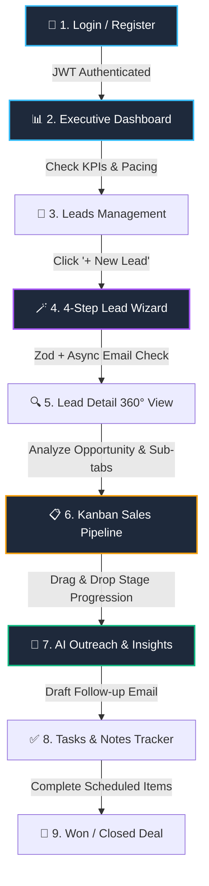

# 🌟 Lumen CRM: Visual Master Guide & Viva Blueprint
**University CIE-2 Capstone Project (Full Stack Development / React 19 Focus)**  
**Student:** Namish M S • **Single Unified Visual Document**

---

## 📌 At-a-Glance Executive Summary
```
┌────────────────────────────────────────────────────────────────────────────────────────┐
│  LUMEN CRM — AI-Powered Revenue Intelligence & Pipeline Platform                      │
├──────────────────────────┬─────────────────────────────┬───────────────────────────────┤
│  ⚡ FRONTEND             │  🛠️ BACKEND                  │  🧪 TESTING & METRICS         │
│  • React 19 + Vite       │  • Node.js + Express REST   │  • 33/33 Vitest Tests Passing │
│  • React Router v7 (SPA) │  • 34 Total API Endpoints   │  • 0 ESLint Errors            │
│  • Tailwind CSS v4       │  • JWT Auth + bcryptjs      │  • 46 Production Build Chunks │
│  • @dnd-kit Kanban Board │  • In-Memory Store (store.js)│  • 16 Route Definitions      │
│  • RHF + Zod Validation  │  • Swappable AI Interface   │  • Sub-second (~700ms) Build  │
└──────────────────────────┴─────────────────────────────┴───────────────────────────────┘
```

---

## 🗺️ 1. Complete End-to-End User Flow



### The 8-Step Daily Sales Flow (Walkthrough Story)
1. **Login & Guard (`/login`):** Rep signs in. Token stored in `localStorage`, guarded by `ProtectedRoute`.
2. **Morning Dashboard (`/`):** Rep checks live revenue KPIs, overdue tasks, and 30D/1Y cadence charts.
3. **Inbound Lead Intake (`/leads`):** Rep opens the 4-step wizard. Step validation and async duplicate email check run automatically.
4. **Lead 360° Profile (`/leads/:leadId`):** Rep inspects nested sub-tabs (`overview`, `activity`, `notes`, `tasks`, `ai`).
5. **Visual Deal Progression (`/pipeline`):** Rep drags deals across Kanban stages with optimistic updates and instant rollback if network fails.
6. **AI Assistant (`/settings` or Lead Drawer):** Rep generates personalized outreach email drafts and lead health scores.
7. **Execution & Reminders (`/tasks`):** Rep marks overdue action items complete with automatic progress bar updates.
8. **Spotlight Search (`Ctrl+K`):** Rep instantly jumps to any deal or contact using the command palette.

---

## 🏗️ 2. System Architecture & Data Flow

```
┌────────────────────────────────────────────────────────────────────────────────────────┐
│                                CLIENT BROWSER (React 19 SPA)                           │
│                                                                                        │
│  [ UI Layer: Tailwind v4 + CVA ]   [ State Layer: Contexts & useReducer ]              │
│  • Pages (Lazy Loaded)             • AuthContext (JWT session)                         │
│  • UI Primitives (Button, Dialog)  • NotificationsContext (30s Polling)                │
│  • @dnd-kit Kanban Board           • usePipelineReducer (Optimistic State + Rollback)  │
│  • React Hook Form + Zod           • useLeads (useSearchParams URL Filter Sync)        │
└──────────────────────────────────────────┬─────────────────────────────────────────────┘
                                           │
                                  [ Axios API Client ]
                        • Request Interceptor: Injects Bearer JWT
                        • Response Interceptor: 401 Auto-Logout
                        • Switch: VITE_USE_MOCK (Real API vs Mock Store)
                                           │
                                           ▼
┌────────────────────────────────────────────────────────────────────────────────────────┐
│                              SERVER LAYER (Node.js + Express)                          │
│                                                                                        │
│  [ Middleware ]                    [ REST Controllers (34 Endpoints) ]                 │
│  • cors()                          • /api/auth (bcrypt, JWT sign/verify)               │
│  • express.json()                  • /api/leads (CRUD, reorder, check-email)           │
│  • authMiddleware (Bearer protect) • /api/contacts, /api/tasks, /api/notes, /api/ai    │
│  • centralized errorHandler        • /api/analytics, /api/search, /api/notifications   │
└──────────────────────────────────────────┬─────────────────────────────────────────────┘
                                           │
                                           ▼
┌────────────────────────────────────────────────────────────────────────────────────────┐
│                              DATA & AI INTEGRATION LAYER                               │
│                                                                                        │
│  • In-Memory Store (`store.js`): Deterministic relational fixtures (reset on restart) │
│  • AI Heuristic Service (`geminiService.js`): Scoring, email & strategic insights      │
└────────────────────────────────────────────────────────────────────────────────────────┘
```

---

## 📊 3. Feature Matrix: Concepts, Files & 1-Sentence Pitch

| # | Feature | User Action / Flow | React & Technical Concept | Key File & Line | 1-Sentence Viva Pitch |
|---|---|---|---|---|---|
| **1** | **Auth & Guard** | Sign in with demo credentials | Context API + Route Guards | [ProtectedRoute.jsx:6](file:///d:/NAMISH%20M%20S/VS%20Code/AI%20CRM%20Dashboard/frontend/src/components/layout/ProtectedRoute.jsx#L6) | *"Guards private routes and restores JWT session state seamlessly on refresh."* |
| **2** | **Dashboard & KPIs** | Toggle 30D / 90D / 1Y / ALL | Recharts + Dynamic Cadence | [DashboardPage.jsx:1](file:///d:/NAMISH%20M%20S/VS%20Code/AI%20CRM%20Dashboard/frontend/src/pages/dashboard/DashboardPage.jsx#L1) | *"Aggregates live revenue KPIs and recalibrates time horizons dynamically."* |
| **3** | **Leads & URL Sync** | Search, filter by status, sort | `useSearchParams` + `useMemo` | [useLeads.js:12](file:///d:/NAMISH%20M%20S/VS%20Code/AI%20CRM%20Dashboard/frontend/src/hooks/useLeads.js#L12) | *"Synchronizes table filters with URL search params so filtered views are shareable."* |
| **4** | **4-Step Wizard** | Enter lead info across 4 steps | `trigger()` + `useFieldArray` | [LeadWizardDialog.jsx:93](file:///d:/NAMISH%20M%20S/VS%20Code/AI%20CRM%20Dashboard/frontend/src/components/leads/LeadWizardDialog.jsx#L93) | *"Enforces per-step Zod validation and async duplicate email checks via uncontrolled refs."* |
| **5** | **Lead 360 Detail** | Click lead ➔ switch sub-tabs | `<Outlet context />` + Nested Routes | [LeadDetailPage.jsx:213](file:///d:/NAMISH%20M%20S/VS%20Code/AI%20CRM%20Dashboard/frontend/src/pages/leads/LeadDetailPage.jsx#L213) | *"Leverages React Router v7 sub-routing and outlet context to isolate tab state."* |
| **6** | **Kanban Pipeline** | Drag deal cards between stages | `useReducer` + Optimistic Rollback | [usePipelineReducer.js:26](file:///d:/NAMISH%20M%20S/VS%20Code/AI%20CRM%20Dashboard/frontend/src/hooks/usePipelineReducer.js#L26) | *"Updates the UI optimistically in 16ms and automatically rolls back if API fails."* |
| **7** | **Tasks Engine** | Check tasks ➔ observe progress | `date-fns` smart overdue detection | [TasksPage.jsx:1](file:///d:/NAMISH%20M%20S/VS%20Code/AI%20CRM%20Dashboard/frontend/src/pages/tasks/TasksPage.jsx#L1) | *"Tracks deadlines with real-time overdue alerts and animated progress bars."* |
| **8** | **Command Palette** | Press `Ctrl+K` ➔ type & select | `useDeferredValue` + Key Listener | [CommandSearch.jsx:38](file:///d:/NAMISH%20M%20S/VS%20Code/AI%20CRM%20Dashboard/frontend/src/components/common/CommandSearch.jsx#L38) | *"Provides non-blocking spotlight search across all CRM entities using deferred values."* |
| **9** | **Notifications** | View unread alerts in top nav | `useEffect` 30s Polling + Cleanup | [NotificationsContext.jsx:58](file:///d:/NAMISH%20M%20S/VS%20Code/AI%20CRM%20Dashboard/frontend/src/context/NotificationsContext.jsx#L58) | *"Polls background alerts with proper timer cleanup to prevent memory leaks."* |
| **10**| **Error Boundary** | Test invalid route / crash | Class component error recovery | [ErrorBoundary.jsx:5](file:///d:/NAMISH%20M%20S/VS%20Code/AI%20CRM%20Dashboard/frontend/src/components/common/ErrorBoundary.jsx#L5) | *"Catches unexpected UI exceptions gracefully using getDerivedStateFromError."* |

---

## 🎯 4. The 10-Minute Demo Script (Punchy Cue Cards)

```
[00:00 - 01:30] INTRO & PROVENANCE
Say: "Lumen CRM is a full-stack sales intelligence platform built with React 19, Tailwind v4, 
and Express. I started with a UI boilerplate for dark styling and mock data, then built the 
entire Express backend, 33 unit tests, Kanban reducer with rollback, 4-step wizard, and URL filter engine."

[01:30 - 03:00] DASHBOARD & LEADS TABLE
Action: Show KPI ribbon ➔ Click 1Y filter ➔ Go to /leads ➔ Filter 'Qualified' + 'High' ➔ Sort by Value.
Say: "The dashboard dynamically recalibrates intake cadence. In the Leads table, all filters 
and sort states are synchronized directly with the URL using useSearchParams."

[03:00 - 05:00] 4-STEP WIZARD & LEAD DETAIL
Action: Click '+ New Lead' ➔ Enter Name ➔ Enter existing email (show error) ➔ Add tag ➔ Create ➔ Open Lead l1.
Say: "The wizard uses React Hook Form uncontrolled refs for 60fps typing, validates each step 
with trigger(), and runs an async duplicate email check. The detail page uses nested Outlet routing."

[05:00 - 07:30] KANBAN PIPELINE DEEP DIVE
Action: Drag deal from 'New' to 'Qualified' ➔ Toggle Fit-to-Screen.
Say: "The pipeline uses useReducer for multi-column state. Dragging triggers an optimistic update 
and stores a snapshot. If the server fails, it rolls back seamlessly. DealCard uses React.memo."

[07:30 - 09:00] TASKS, COMMAND PALETTE & NOTIFICATIONS
Action: Check off a task ➔ Press Ctrl+K ➔ Type 'deal' ➔ Point to bell notification.
Say: "Tasks detect overdue dates via date-fns. Ctrl+K uses useDeferredValue for instant spotlight navigation. 
Notifications poll every 30s with proper useEffect cleanup."

[09:00 - 10:00] CODE DRILL & CLOSING
Say: "We have 33 tests passing, 0 lint errors, and 34 REST endpoints. I am ready for your questions!"
```

---

## ⚡ 5. The Top 10 Code Snippets Cheat Sheet

```
1. Protected Route Guard       ➔ frontend/src/components/layout/ProtectedRoute.jsx:6-23
2. Pipeline Reducer            ➔ frontend/src/hooks/usePipelineReducer.js:26-47
3. Optimistic Rollback Handler ➔ frontend/src/hooks/usePipelineReducer.js:140-155
4. Wizard Step Trigger         ➔ frontend/src/components/leads/LeadWizardDialog.jsx:93-118
5. Dynamic Tags useFieldArray  ➔ frontend/src/components/leads/LeadWizardDialog.jsx:75-87
6. Zod Validation Schemas      ➔ frontend/src/lib/validation.js:48-85
7. Axios Interceptor / 401     ➔ frontend/src/lib/api.js:10-32
8. Notifications Polling       ➔ frontend/src/context/NotificationsContext.jsx:58-81
9. URL Filter Sync Hook        ➔ frontend/src/hooks/useLeads.js:12-22 & 85-104
10. Mock/Real Switch           ➔ frontend/src/lib/services/config.js:1 & leads.js:5-9
```

---

## 🛡️ 6. The 6 Honest Architectural Trade-Offs (Say Upfront)

1. **Simulated AI Service:** AI scoring and email drafting use a simulated heuristic service adapter with a swappable interface rather than live paid LLM API calls.
2. **In-Memory Backend Store:** The Express server uses an in-memory fixture store (`store.js`) for deterministic, zero-config viva demos (MongoDB planned for Phase 4).
3. **`localStorage` Token:** JWT is stored in `localStorage` for SPA ease of demonstration; production would use `httpOnly` secure cookies.
4. **Client-Side Pagination:** Leads table paginates the in-memory array in `useLeads.js`; server-side query pagination will be implemented for large enterprise scale.
5. **30s Polling over WebSockets:** Notifications use lightweight interval polling with cleanup to avoid WebSocket server overhead.
6. **Uncontrolled Form Inputs:** React Hook Form uses DOM refs to prevent re-renders on every keystroke.
